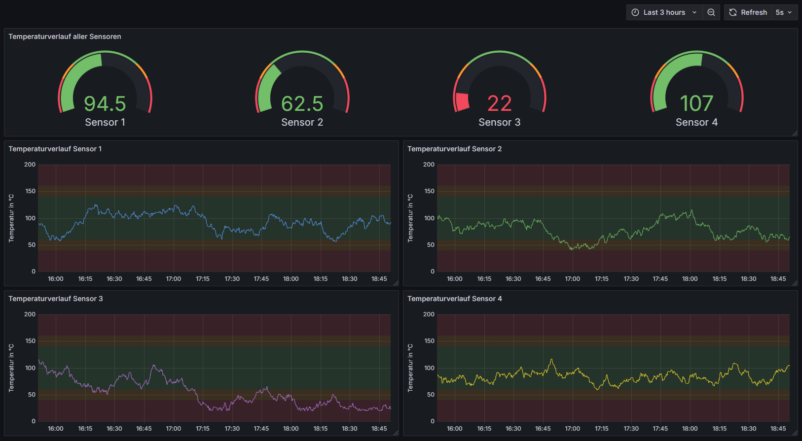
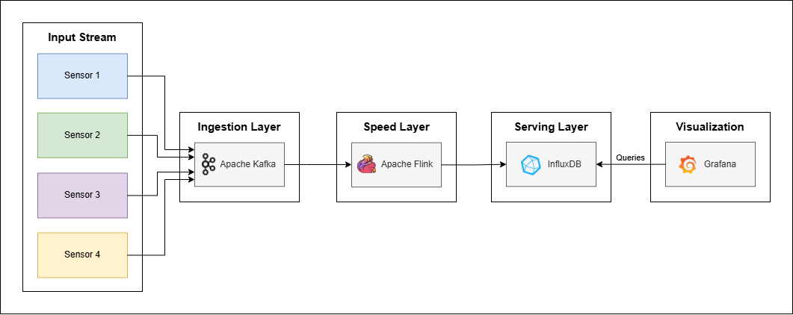

# IU Data Analytics und Big Data

Projektrepository für das Modul **Data Analytics und Big Data (DLBINGDABD01)**.

## Projektbeschreibung

Ziel dieses Projekts ist die Entwicklung einer **Datenverarbeitungs-Pipeline nach der Kappa-Architektur**, die Temperaturdaten von vier Temperatursensoren verarbeitet und in Echtzeit in einem Dashboard darstellt.

Da es sich um einen Prototyp handelt, werden die Temperatursensoren durch ein Python-Skript simuliert.

## Visualisierung

## Verwendete Technologien und Architektur

- **Docker:** Zum Builden des Flink-Jobs sowie zum Bereitstellen aller benötigten Dienste
- **Apache Kafka:** Empfängt als *Ingestion Layer* die Rohdaten der Temperatursensoren
- **Apache Flink:** Verarbeitet als *Speed Layer* die Sensordaten aus Kafka
- **InfluxDB:** Speichert die verarbeiteten Daten als *Serving Layer* für schnelle Abfragen
- **Grafana:** Visualisiert die Temperaturdaten in Echtzeit in einem Dashboard